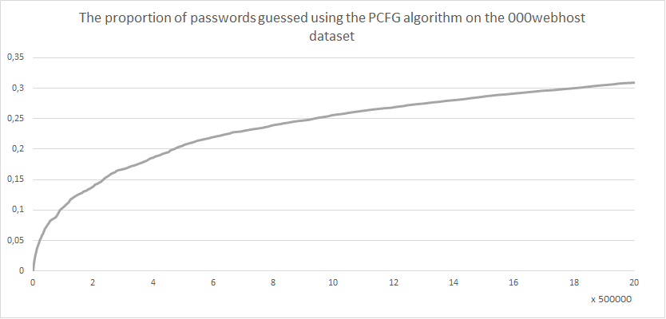
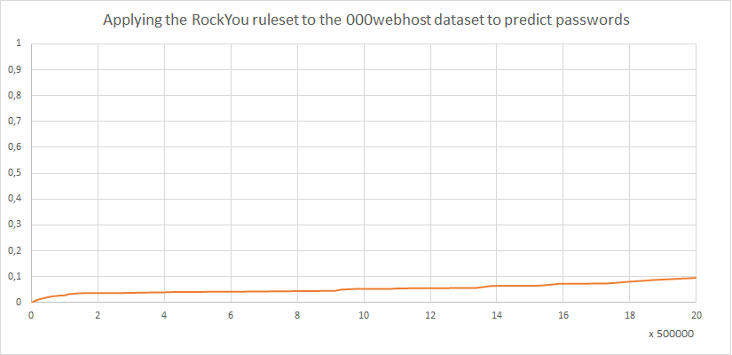

## Testing
PC Configuration:
- Processor: AMD Ryzen 5 8600G w/ Radeon 760M Graphics 4.35 GHz;
- RAM: 64.0 GB;
- Graphics processor: NVIDIA GeForce RTX 3090.

The experimental evaluation of the algorithm was carried out using the Password Research Tools program.
(link: https://github.com/lakiw/Password_Research_Tools)

## Results

- etalon — 669643 passwords; 
- limit — 10000000 itr.

- etalon — 2252318 passwords; 
- limit — 10000000 itr.

- etalon — 24252 passwords; 
- limit — 10000000 itr.

- etalon — 669643 passwords; 
- limit — 20000000 itr.